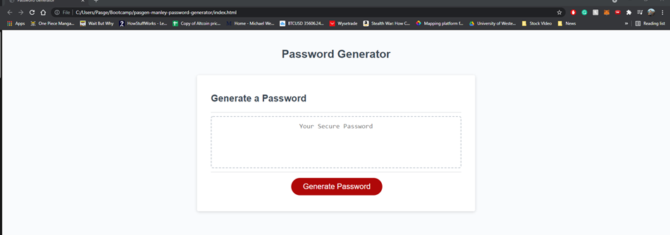
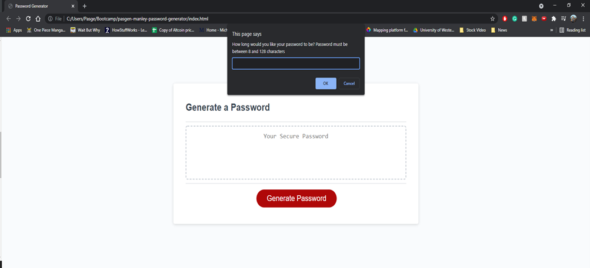
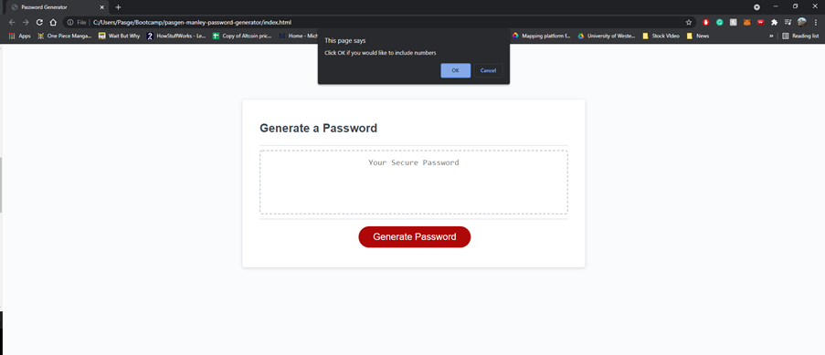
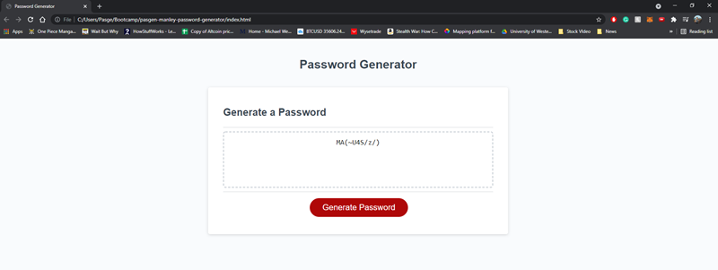

# pasgen-manley-password-generator

## Project description

The project's aim was to create a password generator that randomly generates a password based on the criteria from the user prompts.

When the user clicks on the generate password button, a windows prompt appears. The prompt begins by asking them how long they would like their password to be and that it must be between 8 and 128 characters. If the password is outside that range then another prompt tells them they have to enter characters in that range and sends them back to the initial prompt. 

Once the character length has been chosen then a series of other prompts follow, asking whether they want to include; numbers, lowercase letters, uppercase letters, and special characters. Each one of these variables can either be chosen or rejected, however, at least one must be selected for the application to continue; if not the user is looped back to the beginning of these prompts. 

When the parameters are decided on, the chosen variables are chosen at random appear in the password textarea. 

### Project Images

Initial screen when you open the application.

Windows prompt after pressing generate password

Windows prompt / confirm when choosing passwork variables.

Example of generated password

#### Link to the deployed application

